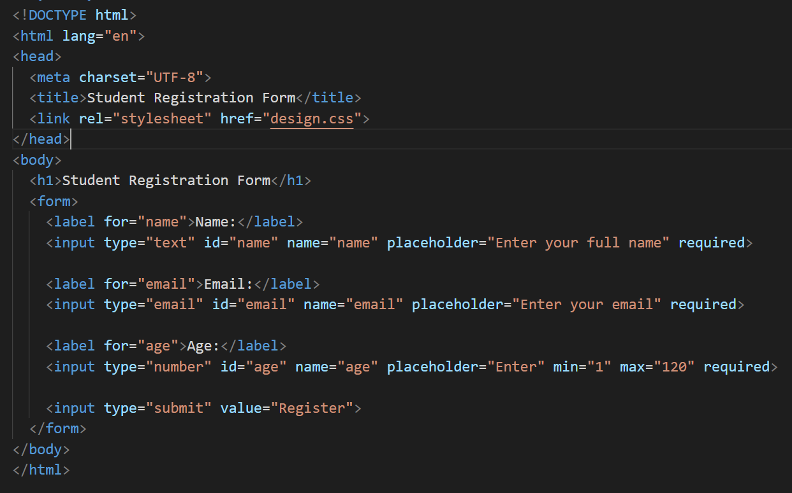
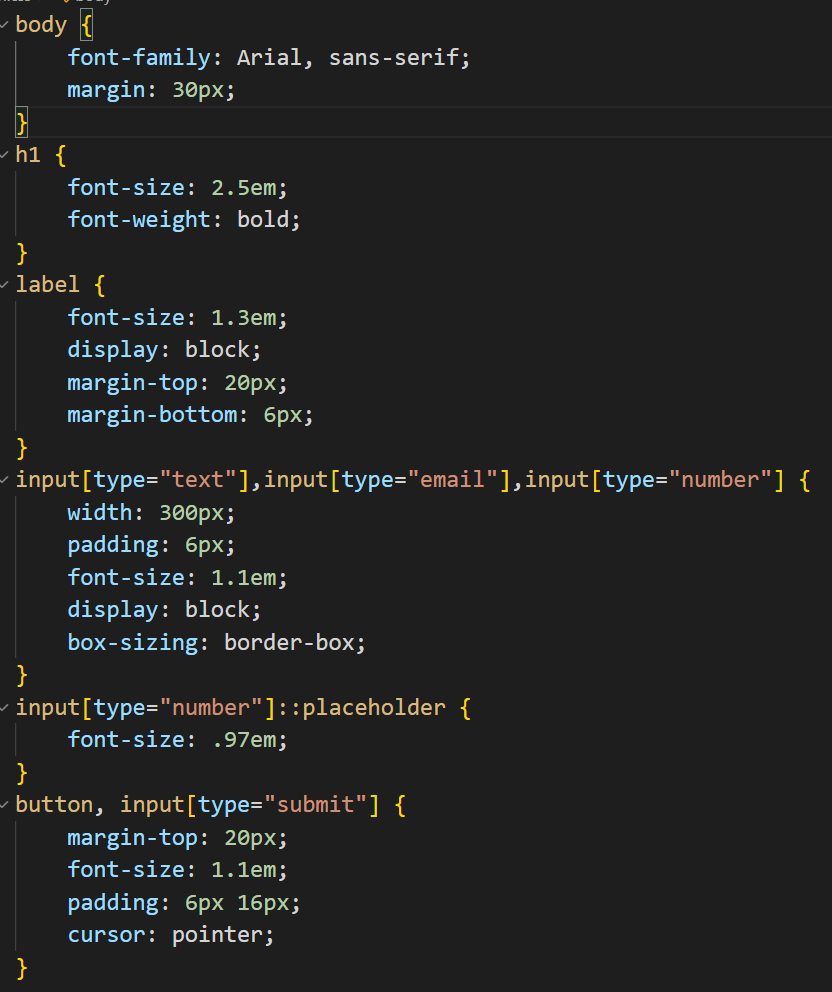
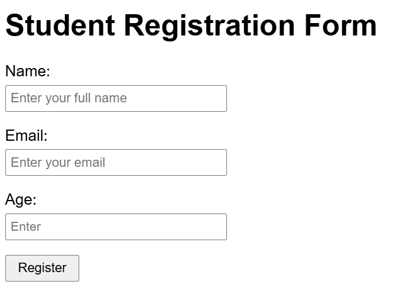

# Student Registration Form with HTML5 Validation

## 🎯 AIM
Design and implement a basic student registration form that collects user information and validates inputs using HTML5 features.

## 📋 Task Description
Create a student registration form using HTML. The form should include fields for:

- **Name**
- **Email**
- **Age**

Add appropriate HTML5 validation to ensure each field is correctly filled before form submission.

## Screenshots
### Code HTML5

### Code CSS

### Result

